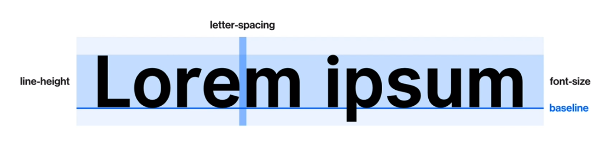

# Typography



## font-size

- 글씨의 크기
  - px
    - 절대 단위
  - em
    - 상대 단위
    - 실제로 적용 된 폰트의 크기 (부모 요소 라던지)
    - 부모의 폰트가 20px라면 해당 요소의 1em은 20px가 됨
  - rem (root em)
    - 상대 단위
    - HTML에 적용 된 폰트 크기

## line-height

- 줄 간격
  - px
  - em
  - rem

```css
/* line-leight를 표현 할 때에는 주로 em을 사용한다. */
/* 적용 된 폰트 사이즈에서 얼마나 키울지를 주료 표현하기 때문에 */

.text {
  font-size: 16px;
  line-height: 1.5;
  /* em을 생략하는게 관례 */
}
```

- 줄 간격의 크기에 관계 없이 글자는 가운대에 표시 되므로 알아 둘 것.

## letter-spacing

- 자간 (글자의 간격)

  - px
  - em

- 보통은 해당 폰트 사이즈에 비례해서 얼마나 줄이느냐 생각하므로 em을 주로 사용.
  - 단, line-height 처럼 em을 생략하면 안 된다.

## font-family

- 폰트 서체

```css
.text {
  font-family: "Poppins";
  font-family: "Poppins", sans-serif;
  /* Poppins가 있으면 적용, 없으면 sans-serif를 적용 */
  font-family: "Poppins", "Roboto", sans-serif;
  /* Poppins가 있으면 적용, 없으면 roboto를 적용, 없으면 sans-serif를 적용 */
}
```

## font-weight

- 폰트 굵기
  - 100 단위
  - 자주 쓰는 단위는
    - Regular : 400
    - Bold : 700

```css
.text {
  font-weight: 700;
}
```

## color

- 폰트 색상
  - hex
    - #0066ff 같은 형식
  - rgb
    - rgb(0, 102, 255) 같은 형식
  - rgba
    - rgb를 기준으로 투명도가 더해진 형식
    - rgba(0, 102, 255, 1) 같은 형식

---

## text-align

- 텍스트 정렬
  - left
  - right
  - center

## text-indent

- 들여쓰기

```css
.text {
  text-indent: 100px;
}
```

## text-transform

- 텍스트 변형
  - 알파벳 베이스에 사용.
    - none
    - capitalize
      - 첫 문자만 대문자로
    - uppercase
      - 전부 대문자로
    - lowercase
      - 전부 소문자로

## text-decoration

- 텍스트의 선

  - none
  - underline
    - 글자 밑 선 긋기
  - line-through
    - 글자 가운대 선 긋기
  - overline
    - 글자 위 선 긋기

- 주로 a 태그의 선을 지우거나 할 때 씀. (none)

## font-style

- normal
- italic
  - 글 씨 기울이기
- oblique
